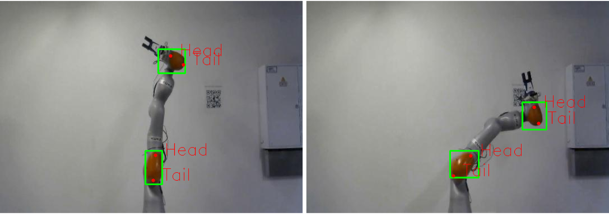

# Introduction to Computer Vision Project
### Innopolis University, Fall 2022
____________________
# Pose Estimation for a Robot Manipulator
__________________
## Team 
* Mirna Alnoukari
* Anton Buguev
* Elizaveta Kovanova

## Project description
This project proposes a solution for position estimation of a single industrial manipulator using learning methods.

The model uses Region Based Convolutional Neural Network (R-CNN) to track robot keypoints which allows to predict the pose of robotic manipulator. The keypoints are defined as:
* A robot joint;
* The joint's "head";
* The joint's "tail".


## Dataset 
Dataset was created and preprocessed using [Roboflow](https://roboflow.com/).
Available in a ```Keypoints.v2i.yolov5pytorch.zip``` archive.


## Model
The model is created, saved, and tested in the ```Pose_estimation.ipynb```.

Jupiter Notebook ```Demonstration.ipynb``` is used for demonstration purposes, where both the dataset and model are loaded in to illustrate the predictions.

## Installation guide

### Prerequisites 
* ```python v3``` is required (v3.7+). Its installation guide can be found [here](https://www.python.org/downloads/)
* PyTorch Vision library for object detection
The necessery files can be obtained [from the repository](https://github.com/pytorch/vision/tree/main/references/detection) directly.
* Additionally, the following python libraries are required:
```
torch
torchvision
albumentations
cython
pycocotools
matplotlib
numpy
```
These can be installed using [```pip```](https://pip.pypa.io/en/stable/installation/)
### Further installation and launch
1. Clone the repository:
```
git clone https://github.com/mirnanoukari/Pose-Estimation.git
```
2. Run ```Pose_estimation.ipynb``` to create and save the model;
3. Run ```Demonstration.ipynb```.
